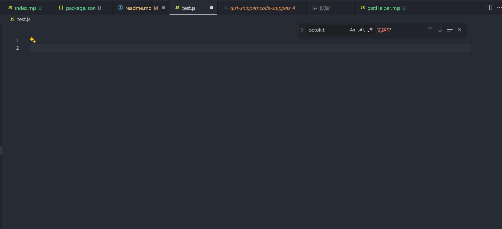
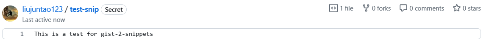
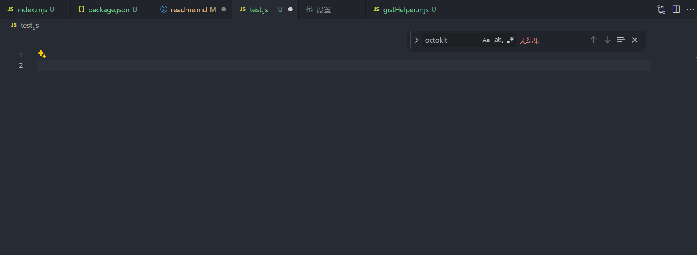

# gist-2-snippets
一键将github gist转换成vscode snippets的命令行工具。

## 相关介绍
### github gist
> [Gist](https://gist.github.com/)，是Github提供的一个子服务，可以在线分享比较小的代码片段，同样的代码如果用传统创建仓库的方式分享可能就显得笨重了。Gist就是一个精简版的Repository。

[github gist介绍](https://docs.github.com/zh/get-started/writing-on-github/editing-and-sharing-content-with-gists/creating-gists)

### vscode snippets
> Snippet: 片段。VSCode Snippets，意指VSCode里预定义的代码片段或者代码模板，快速实现代码补全。
> 你可能没听说过VSCode Snippets，但你一定在开发中使用过。最常见的应该是console.log和for循环。比如，当你输入log，就会弹出提示，按Tab键或者Enter键，log就会变成console.log()，光标定位在括号中间的位置。




[vscode snippets介绍](https://juejin.cn/post/7076609496046370847)


## 开始使用

### 1. 安装
```
npm install -g gist-2-snippets
```
### 2. 一键使用
如果你是首次使用，你需要登录你的github，获取一个可以访问gist的token，并登录

获取token的方式如下：
1. 点击你的头像，选择Settings
2. 选择Developer settings
3. 选择Personal access tokens
4. 点击Generate new token
5. 勾选gist权限
6. 点击Generate token
7. 复制生成的token

然后在命令行输入以下命令：

```bash
$ gist-2-snippets pull
```

接下来，命令行会提示你输入token，输入你刚刚生成的token即可。

然后，命令行会提示你选择你的vscode snippets文件夹路径，分为`全局`和`当前目录`两种，你可以根据自己的需求选择。

全局路径一般在这个目录下：C:\Users\yourname\AppData\Roaming\Code\User\snippets

完成以上步骤后，你的gist就会被同步到你的vscode snippets中。

接下来就可以愉快的使用了！

### 3. 使用
在你的vscode中，打开一个文件，输入你的snippet的前缀，然后按`tab`键或者自动提示出来的回车，你的snippet就会自动补全。

比如这是我的一条gist：


使用上述步骤同步到vscode snippets后，我在vscode中输入`test-snip`，然后按`tab`键，就会自动补全为我之前定义的代码片段：


### 4. 其他命令
清除用户token和snippets文件夹路径
```bash
$ gist-2-snippets clear
```

只清除用户token
```bash
$ gist-2-snippets clear-token
```

只清除snippets文件夹路径
```bash
$ gist-2-snippets clear-folder
```

## 其他说明

1. 生成出来的文件会以`gist-snippets.code-snippets`的文件名命名，文件内容已自动转变为vscode可识别的snippets内容。
2. 生成的snippets和gist的字段对应关系为

    | gist | snippets |
    | --- | --- |
    |文件名|prefix|
    |description|description|
    |文件内容|body|
    |id|gistId|


## 推荐插件
配合下面这个vscode插件使用，可以更方便的在vscode里管理你的gist

[vscode-gist](https://github.com/kenhowardpdx/vscode-gist)
> Access your GitHub Gists within Visual Studio Code. You can add, edit, and delete public and private gists.
>
> 在Visual Studio Code中访问您的GitHub Gists。您可以添加、编辑和删除公共和私有Gists。
